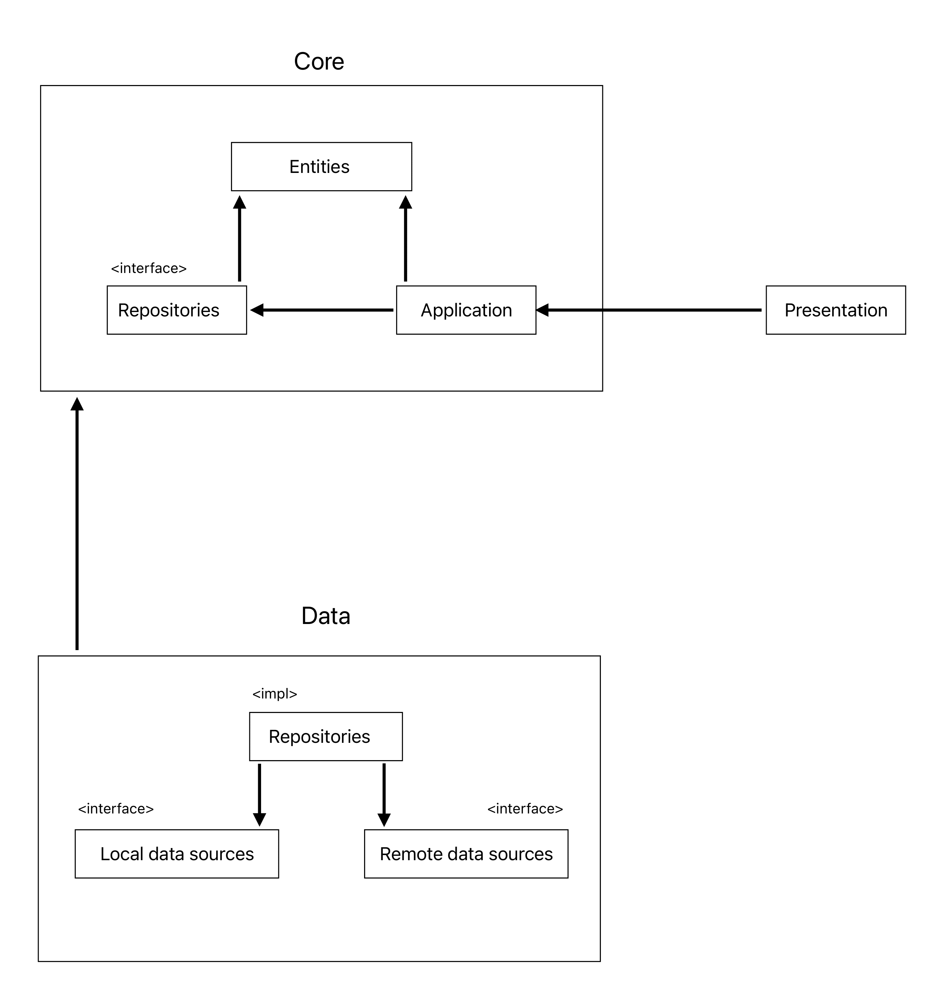
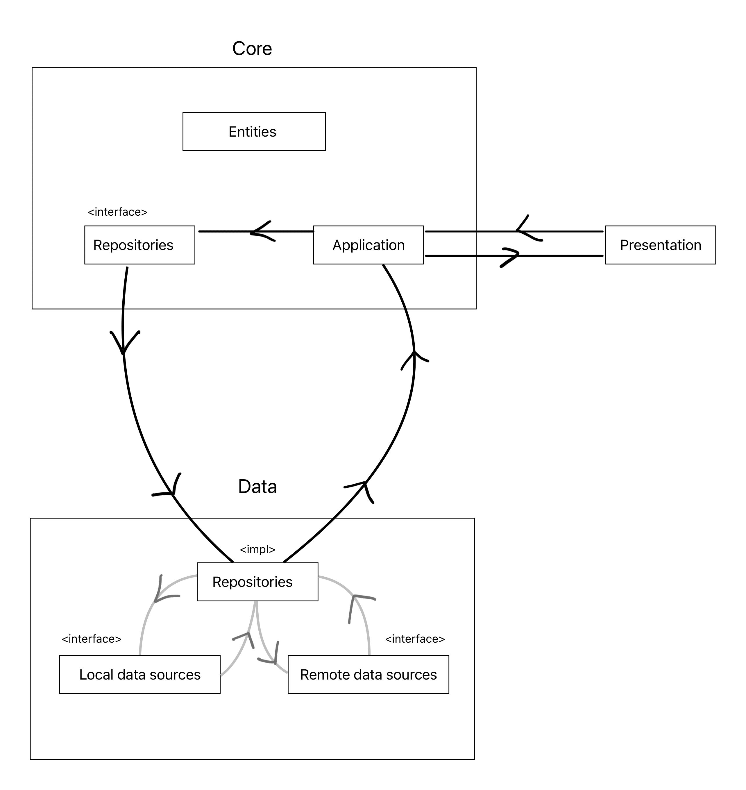

# React + TypeScript + Vite

## Introduction

This application provides a minimal setup to get React working in Vite with HMR and some ESLint rules.

## How to run

1/ Make `.env` file:
`VITE_APP_API_URL`: Fetch API url
`VITE_APP_ENABLE_API_MOCKING`: Flag to run mock server. Value `false` or `true`

- Example:
```code
VITE_APP_API_URL=https://api.employee-managment.com/api  
VITE_APP_ENABLE_API_MOCKING=true 
```

2/ Run `make run`

## Usage

To use this project, follow these steps:

Access the application
Once the services are running, access the application at [local URL, e.g., http://localhost:8000].

## Available Scripts

### `yarn install`

- Install all packages that require to run the app.

### `yarn dev`

- Runs the app in the development mode.

### `yarn build`

- Builds the app for production to `dist` folder

### `yarn preview`

- Preview the build of the production in local environment

### `yarn format`

- Format the code following the rule config in `@/src/.prettierrc.cjs`

### `yarn lint`

- Check ESlint of the code following the rule config in `@/src/.eslintrc.cjs`

### `yarn lint:fix`

- Fix ESlint error following the rule config in `@/src/.eslintrc.cjs`

### `yarn test`

- Runs unit tests for your application. These tests verify if individual parts of your code function as expected.

### `yarn test:coverage`

- Runs the tests and also generates a report that shows how much of your code is covered by the tests. High coverage indicates that most parts of your code have been tested.

### `yarn test:e2e`

- Runs end-to-end (e2e) tests in the application. These tests simulate user interactions and verify the overall functionality of the app from the user's perspective

### `yarn test:e2e:ui`

- Same with `yarn test:e2e` but in interactive UI mode, with a built-in watch mode

[All script available](./package.json)

### Project structure

**Core**: containing our entities, application (use-case). This is what the application is at its core (hence the name).

**Data**: containing implementations of repositories for retrieving data from external services. This is how we get and store data.

**Presentation**: This layer is how the user sees and interacts with our application. It contains Angular/React/Vue.

**Dependency graph:**



**Dependency flow:**



`src` Directory:

```sh
|-- assets/
|   └── ...  // Static files such as images and fonts
|-- application/
|   └── ...  // Specific business use cases for the application
|-- components/
|   └── ...  // Reusable UI components
|-- config/
|   └── ...  // Configuration files like env variables
|-- constants/
|   └── ...  // Shared constant
|-- domain/
|   └── ...  // Define all the core entites model
|-- infrastructure/
|   └── ...  // Define how the application layer interacts with external and local data
|-- features/
|   └── ...  // Feature-specific folders with components, hooks, etc.
|-- presentation/
|   └── ...  // UI and Layout logic for each features contains Angular/React/Vue code.
|-- providers/
|   └── ...  // Application providers (HOC)
|-- hooks/
|   └── ...  // Shared custom hooks
|-- lib/
|   └── ...  // Pre-configured third-party libraries
|-- app/
|   └── ...  // Application routing configuration
|-- stores/
|   └── ...  // Global state management
|-- types/
|   └── ...  // TypeScript types and interfaces
|-- utils/
|   └── ...  // Shared utility functions
|-- main.tsx
|-- index.html
```